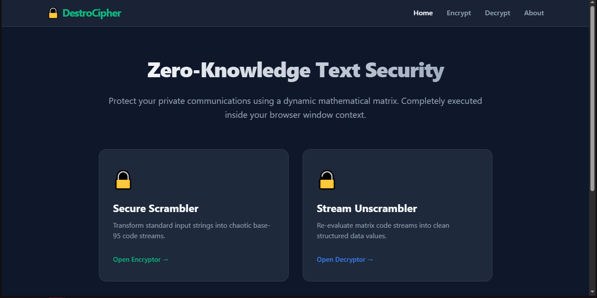
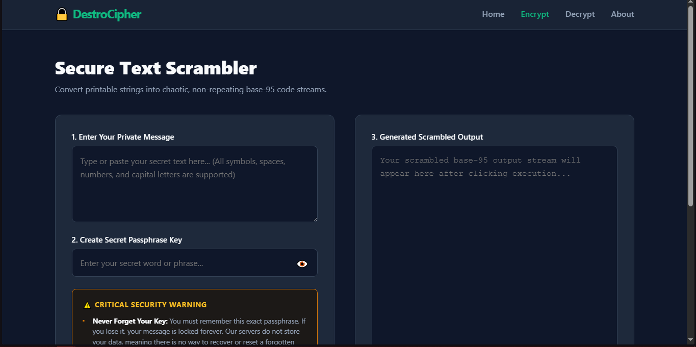
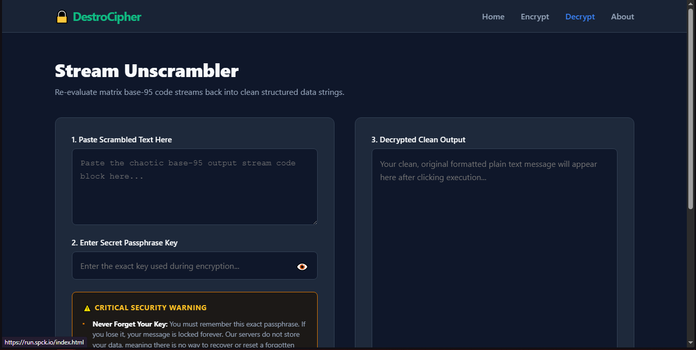
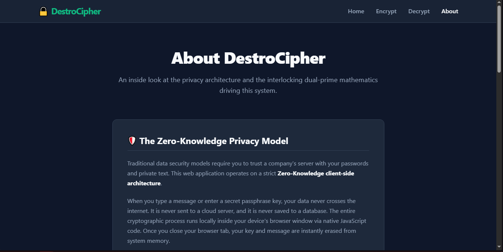

# ⚡ DestroCipher

A premium, privacy-first, Zero-Knowledge text obfuscation engine driven by pure client-side mathematics. Powered by a custom **Base-95 Interlocking Dual-Prime Stream Cipher Matrix**, DestroCipher completely scrambles raw communications into chaotic code streams that cannot be decrypted without the exact matching passphrase key.

## 📸 Interface Showcase

### Home Hub Portal


### Secure Scrambler (Encryptor View)


### Stream Unscrambler (Decryptor View)


### Technical Specifications Matrix (About View)


## 🛡️ The Zero-Knowledge Privacy Model
Traditional text encoders rely on central databases or server-side transmission cycles to function. **DestroCipher** operates under a strict, absolute client-side architecture:
- **Zero Server Contacts:** Your private plain-text inputs and secret keys never cross the internet.
- **Local Isolation:** The cryptographic calculations process entirely inside your device's browser window context via native JavaScript.
- **Ephemeral Framework:** No cookies, tracking systems, or database logs exist. The exact second you close your browser tab, your messaging footprints are instantly destroyed from active system memory.

## 🧮 The Core Mathematical Mechanics
To maximize security against standard dictionary attacks and pattern-based frequency scripts, the background calculation engine transforms characters dynamically using non-linear math operations:
1. **Positional Key Generator:** Converts your human-readable passphrase word into a massive positional integer key (\(k\)) utilizing base-95 progression bounds.
2. **Twin interlocking Prime Engines:** For every character processed at index position (\(i\)), two independent state variables update across separate large prime boundaries (**997** and **1009**):
   - \(X_i = (X_{i-1} \times 31 + \theta_{i-1} + i) \bmod 997\)
   - \(Y_i = (Y_{i-1} \times 41 + \theta_{i-1} + i) \bmod 1009\)
3. **Dynamic Shift Extraction:** Fuses both prime state variants to pull an unpredictable, moving shifting value (\(S_i\)) per character, ensuring identical repeated inputs (like `AAAAAA`) yield random output variations:
   - \(S_i = ((X_i + Y_i) \bmod 94) + 1\)
4. **Bit-Perfect Parity:** Scales standard character boundaries to a full 95-character printable ASCII suite, guaranteeing flawless structural restoration of all spacing gaps, indentation tabs, integers, case shifts, and keyboard grammar symbols.

## 📁 Repository File Tree
```text
my-encryption-site/
│
├── index.html       # Universal landing portal page
├── index.css        # Portal grid card style layers
├── index.js         # Navigation hub link controller
│
├── encrypt.html     # Secure text scrambler interface
├── encrypt.css      # Dual-pane form layout alignments
├── encrypt.js       # Script routing encrypt actions to engine
│
├── decrypt.html     # Stream unscrambler interface
├── decrypt.css      # Electric-blue accented tool layouts
├── decrypt.js       # Script routing decrypt actions to engine
│
├── about.html       # Technical specifications manifesto page
├── about.css        # Paragraph typography readability rules
├── about.js         # Isolated view mount observer
│
├── all.css          # Global master stylesheet (Theme, Nav Menu, Page Fade Keyframes)
├── engine.js        # Core crypto cipher looping & intersection scroll reveals script
│
├── sc1.png          # Screenshot: Main Page
├── sc2.png          # Screenshot: Encrypt Page
├── sc3.png          # Screenshot: Decrypt Page
├── sc4.png          # Screenshot: About Page
├── LICENSE          # Legal open-source distribution rules
└── README.md        # Technical project documentation
```

## 🚨 Critical Safety Condition Reminder
Because this platform maintains **zero record histories or key tracking channels**, forgotten passphrases are entirely unrecoverable. Forgetting your secret keyword phrase means you will be permanently unable to redeem your original plain-text contents, unless you possess advanced secondary cryptanalysis approaches.

## 📄 License
This project is open-source and available under the terms of the [MIT License](LICENSE).
